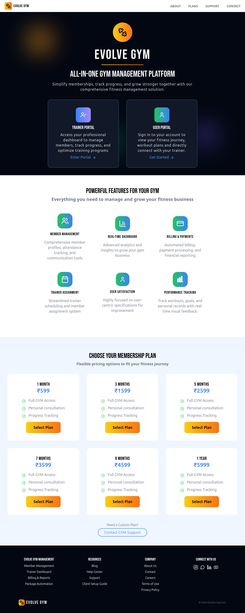
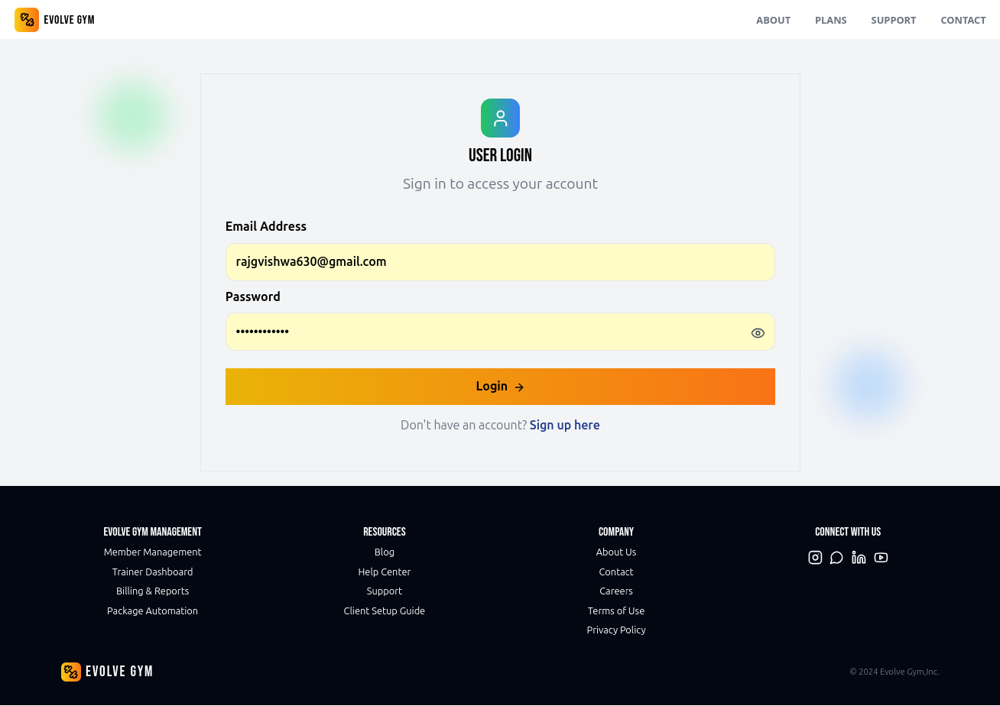
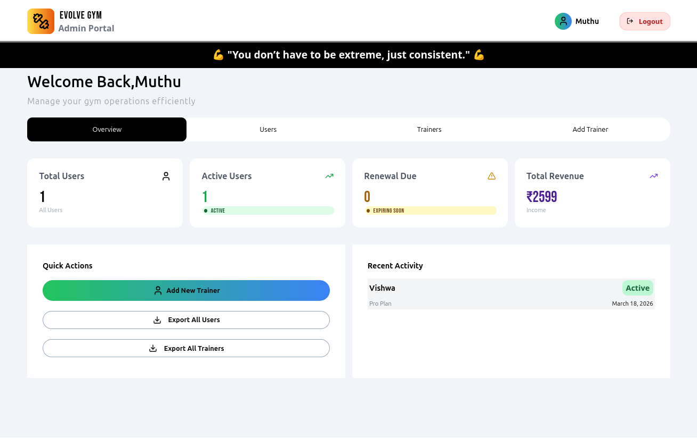
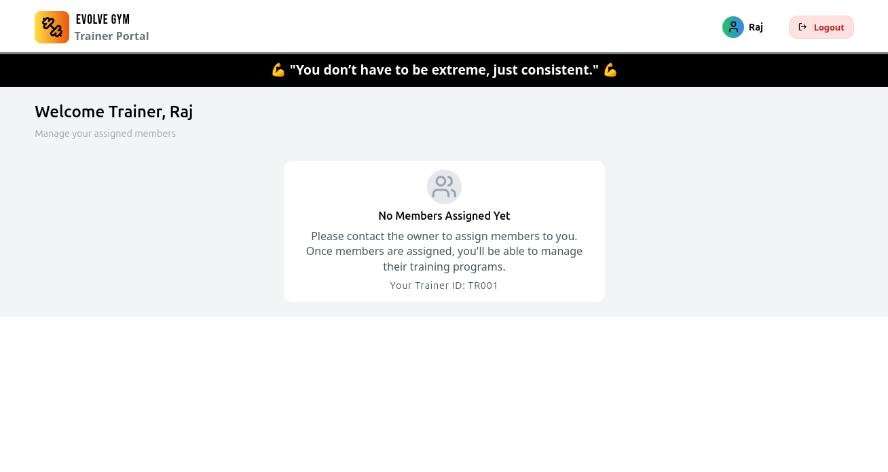
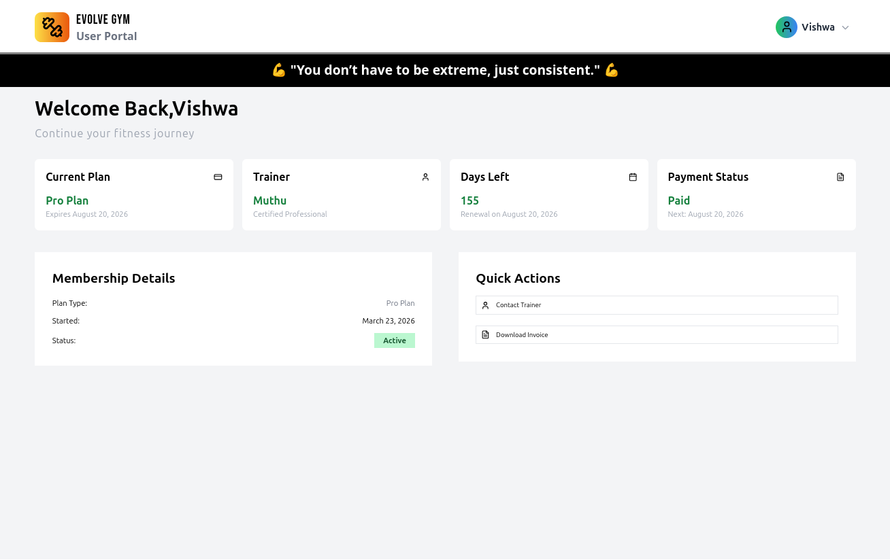

# EvolveGym - A Gym Management System

## Introduction

The Gym Management System is a full-stack web application developed to digitize and streamline traditional gym operations. It replaces manual processes such as member registration, trainer assignment, billing, and plan management with an efficient digital platform.

---

## Project Overview

This system provides a role-based platform where different users can access specific functionalities based on their roles.

---

### User Roles

- **Admin** – Manages members, trainers, plans, and billing
- **Trainer** – Manages assigned clients and tracks progress
- **Member** – Views plans, trainer details, and billing history

---

## Objectives

- To build a responsive and modern gym management system
- To implement secure authentication and role-based access
- To simplify trainer assignment and plan management
- To provide a user-friendly interface for all roles

---

## Features

### Authentication

- Secure login and signup
- JWT-based authentication
- Email verification system

### Admin Features

- Manage users and trainers
- Assign trainers to members
- Manage subscription plans
- View billing details

### Trainer Features

- View assigned members
- Track progress
- Access member plans

### Member Features

- View assigned trainer
- Access billing history
- Manage personal plans

---

## Technology Stack

### Frontend

- React.js (Vite)
- Tailwind CSS

### Backend

- Node.js
- Express.js

### Database

- Supabase (PostgreSQL)

---

## System Architecture

The application follows a client-server architecture:

- Frontend handles UI and user interaction
- Backend processes API requests and business logic
- Database stores user, trainer, plan, and billing data

---

## Screenshots

### 🏠 Landing Page



### 🔐 Login Page



### 📊 Admin Dashboard



### 🧑‍🏫 Trainer Dashboard



### 🙋 Member Dashboard



---

## Project Structure

### Frontend Structure

```
src/
 ├── assets
 ├── components
 ├── context
 ├── icons
 ├── pages
 ├── routes
 ├── services
 ├── App.jsx
 └── main.jsx
```

### Backend Structure

```
backend/
 ├── routes
 ├── services
 ├── utils
 └── server.js
```

---

## Installation

### Clone the Repository

```
git clone <repository-url>
cd gym-management-system
```

### Run Frontend

```
cd frontend
npm install
npm run dev
```

### Run Backend

```
cd backend
npm install
node server.js
```

---

## Testing and Debugging

- Manual testing across devices and browsers
- API testing using Postman
- Debugging using browser console and logs

---

## Challenges Faced

- Email verification delays
- Token expiration handling
- Complex database queries
- Responsive UI adjustments

---

## Future Scope

- Mobile application development
- Payment gateway integration
- Advanced analytics dashboard
- Notification system
- Attendance tracking

---

## Learnings

- Full-stack development workflow
- UI/UX design principles
- API integration
- Debugging and testing
- Team collaboration

---

## Conclusion

The Gym Management System successfully demonstrates a complete full-stack application with modern technologies, role-based access, and scalable architecture.

---

## References

- https://react.dev
- https://tailwindcss.com
- https://supabase.com
- https://nodejs.org
- https://postgresql.org

---

## 👥 Team & Contributions

- **Vishwaraj G** – Full Stack Development
  - Led frontend and backend development  
  - Integrated APIs and database (Supabase)  
  - Managed overall system functionality  

- **Dineshkarthik N** – UI/UX Design & Database Management
  - Designed intuitive and user-friendly UI/UX layouts, improving overall user experience and navigation
  - Developed and optimized database schema for efficient data storage, retrieval, and scalability
  - Integrated frontend designs with backend database systems to ensure seamless functionality

---
